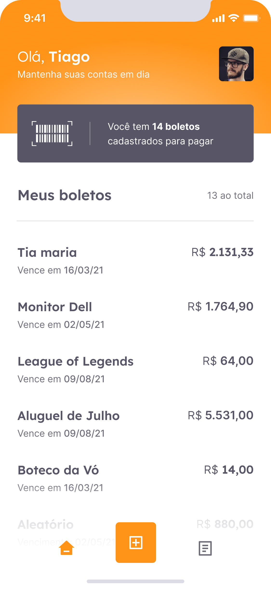

# TRILHA FLUTTER - NEXT LEVEL WEEK DA ROCKETSEAT


Um evento para toda a comunidade evoluir junto, na prática. São dias intensos com hacks de carreira e muita mão na massa.

Na trilha flutter iremos desenvolver o app PayFlow. Um gerenciador de boletos. 

## PayFlow

  


## Código do Desafio
Aula 01 - #together
```
Porque estamos juntos nessa missão. É junto com você que estamos construindo tudo isso. E é por isso que não abrimos mão da comunidade. O NLW é um evento feito para a comunidade se reunir e evoluir em unidade. Esse sincronismo é poderoso. Você já percebeu o quanto estar junto de outros devs que respiram tecnologia, focados em um objetivo comum, compartilhando informações e cooperando faz você evoluir mais rápido. Essa é a essência do NLW. 
```
Aula 02 - #unidade
```
Unidade é Ação coletiva, que tende a um único objetivo; Significa união, integração e cooperação. Na unidade não significa que todos se tornam iguais, que as diferenças desapareçam, mas significa que cada um soma com o grupo a caminhar junto numa mesma visão, num mesmo propósito com os demais, para chegar no nosso objetivo. O próximo nível!
```
